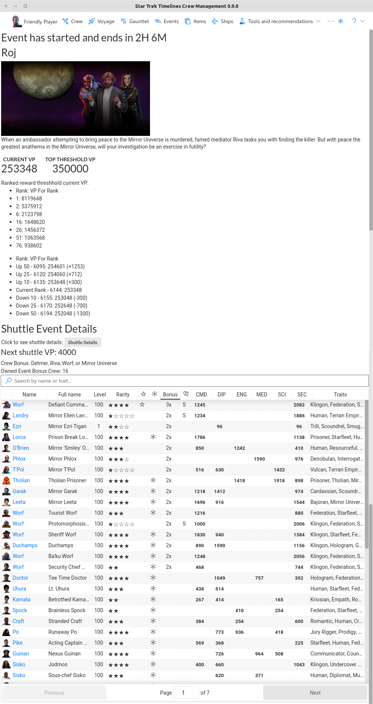
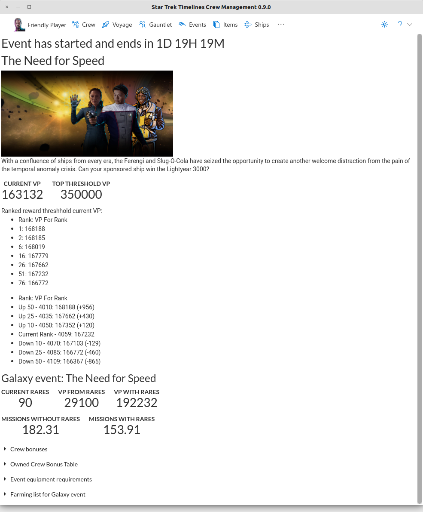
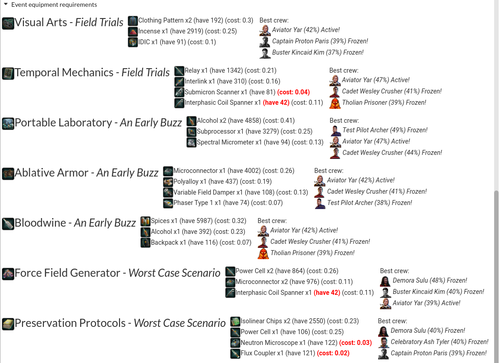

Details of the current event, or shows a message if no event is active or pending.

Notable features:
* Displays event details for all event types
  * Victory points required for tiers in the top 100 players
  * Your current VP and rank, and top threshold reward VP if not yet reached
  * VP, rank, and VP difference for players above and below 10, 25, and 50 rank spots indicates effort required to move up or be moved down
* Faction (Shuttle) events
  * All crew base skills including bonus values, with frozen status and traits
  * VP gained by next shuttle success
* Supply (Galaxy) events
  * Estimated number of craft turnings to complete to gain top reward threshold
  * VP to be gained by turning in super rare event items gained by craft crits
  * Show all bonus crew, including unowned crew
  * Show crew with bonus values, whether they are on a shuttle or voyage, and other details
  * Show all items to be crafted and which are a part of the 3 active missions
    * Top three best crew to craft the item with a crit, chance to crit, and whether they are frozen
  * Items used in all crafting missions and lowest cost (average items dropped per chron spent) in missions where they are farmed
  * Current inventory amounts of items used to craft event items
  * Missions where crafting material items can be farmed
* Skirmish events show crew ship skills for event bonus crew
* Expedition events show bonus crew

Shuttle Events:

Galaxy events:

Galaxy event full bonus crew listing:

Galaxy event owned crew list:

Galaxy event crafting details:

Galaxy event farming list:

