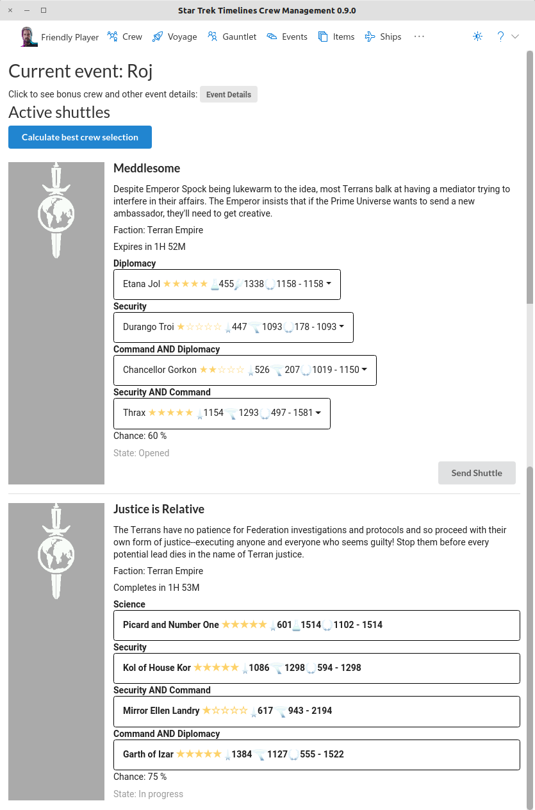

Calculate "best" crew for a open shuttles, as well as monitor the current shuttle status.

Notable features:
* See all active shuttles and current status (opened, in progress, completed)
* Select crew for all shuttles and see chance of success
* Compute a "best" assignment of available crew to shuttles
  * Computes crew for shuttles to make the success percentage even across all open shuttle missions
  * Easy helper for Faction events or daily missions
  * Pre-select certain crew and let it compute the remaining slots
  * Select crew to avoid using in shuttles, such as event crew
* Send shuttles from the tool (game client must be restarted to see changes)

