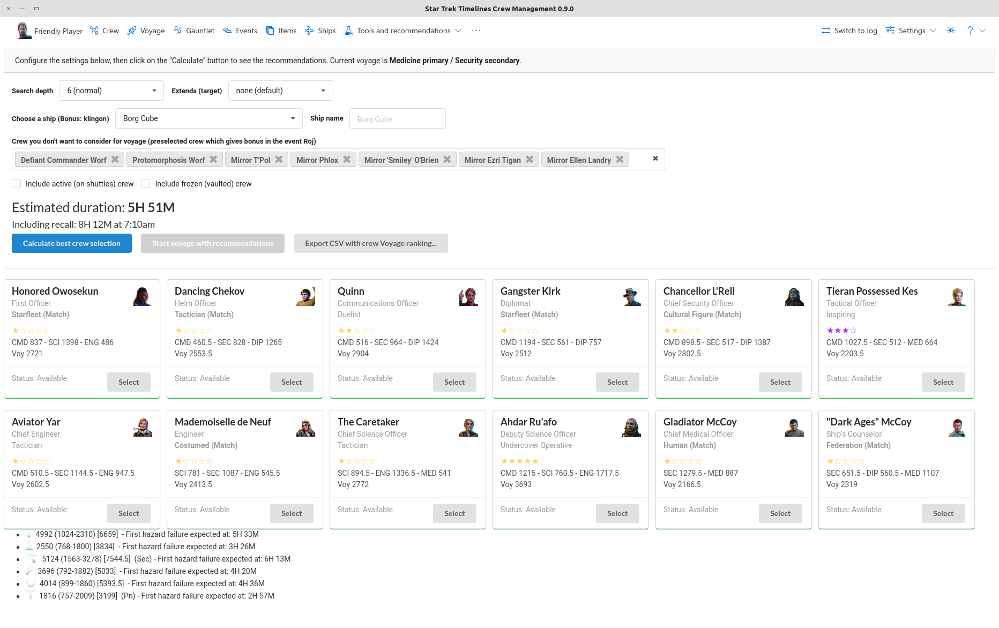
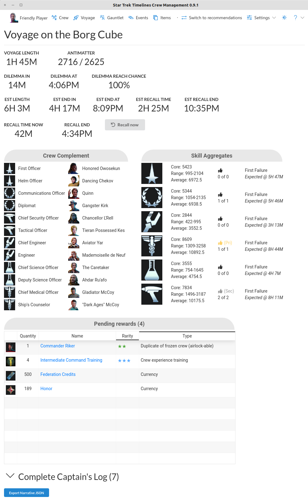

Calculate "best" crew for a voyage, as well as monitor the current voyage.

Notable features:
* Calculate "best" crew for the next voyage
  * Send crew on a voyage from the tool (game client must be restarted to see changes)
  * Automatically exclude event bonus crew
  * Manually exclude or select crew
* Monitor current voyage log
  * Estimated time remaining for current voyage
  * Recalled voyage run time not including recall time
  * Time of next dilemma and duration until next dilemma
  * Estimated time of return if recalled now or recalled when antimatter runs low
  * Listing of voyage rewards, including whether crew is not owned, frozen, or adds a fusion level
* Perform voyage dilemmas or recall the voyage
* Calculate and export best crew for all voyage pairs
* Export voyage log and statistics

