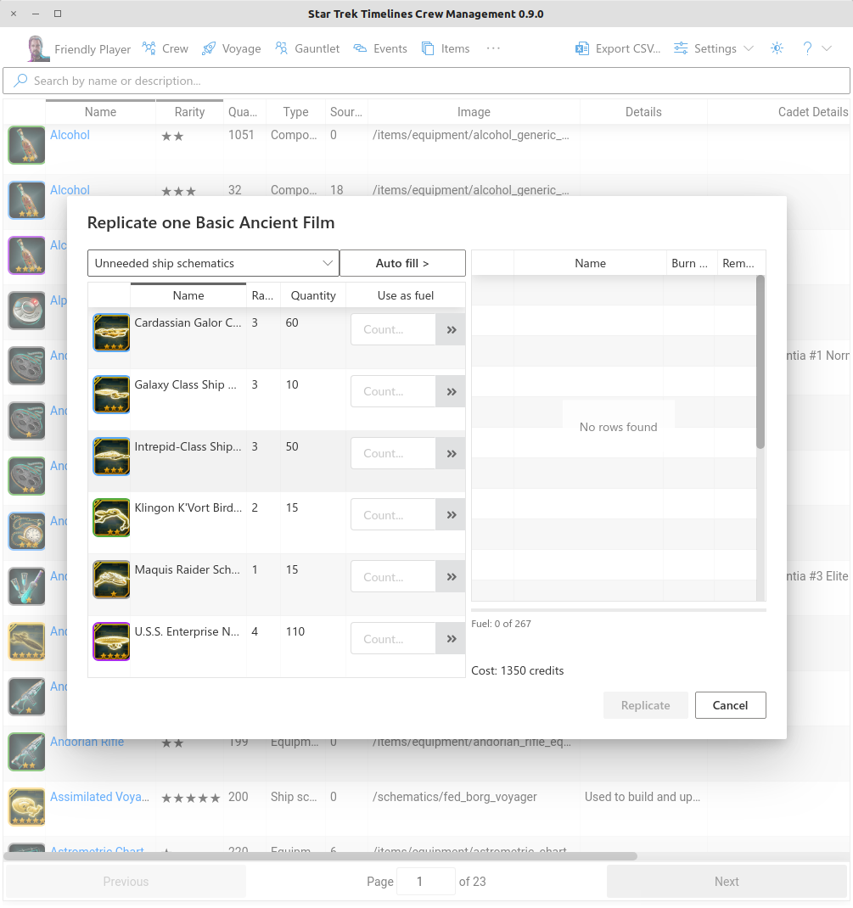

## Features

### Summary Page

Shows summary information, including your player name, DBID, and messages of the day from the devs or your fleet.

Notable features:
* Voyage status - run time, next dilemma time, worst-case estimate of failure
* Gauntlet status - next crew refresh time, gauntlet end time
* Shuttle status - shuttle return time, unused shuttle count
* Daily mission completion status (individual and fleet)
* Inventory max check and Replicator daily use check
* Event status - event pending or started

### Crew

Sort by various fields, group by rarity as well as export the data as Excel or CSV.

Notable features:
* Show detail column sets for "Base", "Gauntlet" (proficiency), or "Voyage" (base + proficiency average)
* Show "big book" tier and whether the crew is available in the portal
* Show "value" - occurrences of this crew in the top ten of various categories among your other crew
* Show gauntlet score (proficiency sum), gauntlet global rank, voyage score, voyage global rank
* Powerful filtering
  * Semicolon for "or", space for "and", allows queries like "dax pilot;mayw;kirk" to find all Dax that are also Pilots and all Mayweathers and Kirks
* Link to click to open in [datacore.app]
* Hover to see equipment and other details; click equipment icon in hover to replicate
* Show count of frozen crew if multiple

### Voyage

Calculate "best" crew for a voyage, as well as monitor the current voyage.

Notable features:
* Calculate "best" crew for the next voyage
  * Send crew on a voyage from the tool (game client must be restarted to see changes)
  * Automatically exclude event bonus crew
  * Manually exclude or select crew
* Monitor current voyage log
  * Estimated time remaining for current voyage
  * Recalled voyage run time not including recall time
  * Time of next dilemma and duration until next dilemma
  * Estimated time of return if recalled now or recalled when antimatter runs low
  * Listing of voyage rewards, including whether crew is not owned, frozen, or adds a fusion level
* Perform voyage dilemmas or recall the voyage
* Calculate and export best crew for all voyage pairs
* Export voyage log and statistics

### Gauntlet

Run gauntlet battles with a helpful UI

Notable features:
* Avoids excessive UI frills for quicker battles
* Display all available gauntlet matchups with chance to beat listed opponent
  * Display fleetmates distinctly from other opponents
* Display all gauntlet crew selections and current status (battles fought, disabled) and allow revive/restore
* Display last gauntlet match details (win/loss, crits, chance to win, last win reward)
* Recommendation mode to help select crew to use in your next gauntlet (if you didn't already start it).
  * This algorithm could use some additional input from contributors.

### Events

Details of the current event, or shows a message if no event is active or pending.

Notable features:
* Displays event details for all event types
  * Victory points required for tiers in the top 100 players
  * Your current VP and rank, and top threshold reward VP if not yet reached
  * VP, rank, and VP difference for players above and below 10, 25, and 50 rank spots indicates effort required to move up or be moved down
* Faction (Shuttle) events
  * All crew base skills including bonus values, with frozen status and traits
  * VP gained by next shuttle success
* Supply (Galaxy) events
  * Estimated number of craft turnings to complete to gain top reward threshold
  * VP to be gained by turning in super rare event items gained by craft crits
  * Show all bonus crew, including unowned crew
  * Show crew with bonus values, whether they are on a shuttle or voyage, and other details
  * Show all items to be crafted and which are a part of the 3 active missions
    * Top three best crew to craft the item with a crit, chance to crit, and whether they are frozen
  * Items used in all crafting missions and lowest cost (average items dropped per chron spent) in missions where they are farmed
  * Current inventory amounts of items used to craft event items
  * Missions where crafting material items can be farmed
* Skirmish events show crew ship skills for event bonus crew
* Expedition events show bonus crew

Shuttle Events:

Galaxy events:

Galaxy event full bonus crew listing:

Galaxy event owned crew list:

Galaxy event crafting details:

Galaxy event farming list:

### Items

Lists all items in your inventory, along with their quantity and type.

Notable features
* Displays item icon, name, rarity, quantity, category, and other details
* Powerful filtering
  * Semicolon for "or", space for "and", allows queries like "clo pat;alc;augment transmission" to find all Clothing Patterns, Alcohol, and items returned from the Augment faction
* *Source* column displays count of missions that provide the item - hover to show all mission details
* Cadet and faction details show whether the item is available via cadet mission or faction shuttle mission
* Click an item icon to replicate
* Filter to items provided by ship battles (in "Settings") to help with skirmish farming

### Item Replication

Select an item to replicate to see the replicator dialog.

Notable features
* Easy to find an item to replicate
  * Replicate an item in your inventory
    * Restrictions exist for certain items that cannot be replicated
  * Opened from
    * Item List (click the icon)
    * Crew page (click the item icon in a crew hover)
  * In the game, it is difficult to replicate because you must dig around in a crew's unequipped item construction tree.
* Easily select items from computed categories
  * Ship schematics for ships at max level
  * Experience trainers
  * Replicator rations
* Easily sort and page through items by name and quantity instead of relying on the icon
  * In the game, it is difficult to see the item label in some cases
  * Usually junk items are few in quantity, such as Dabo rewards

### Shuttles

Calculate "best" crew for a open shuttles, as well as monitor the current shuttle status.

Notable features
* See all active shuttles and current status (opened, in progress, completed)
* Select crew for all shuttles and see chance of success
* Compute a "best" assignment of available crew to shuttles
  * Computes crew for shuttles to make the success percentage even across all open shuttle missions
  * Easy helper for Faction events or daily missions
  * Pre-select certain crew and let it compute the remaining slots
  * Select crew to avoid using in shuttles, such as event crew
* Send shuttles from the tool (game client must be restarted to see changes)

### Ships

Lists the ships you currently have, along with their stats.

Notable features
* Sorting by "Level" also sorts by available schematics to allow more easily locating unneeded schematics

### Cryo Collections

See what active, frozen, and unowned crew exist for each collection, and see your progress with collection milestones.

### Top Crew

See your top 10 crew in various categories

Notable features
* Base values category for six skills
* Proficiency values category for the 16 gauntlet pairs
* Gauntlet global rank for the 16 gauntlet pairs
* Shows *EQ* if missing equipment and *L* if not max level
* Toggle inclusion of frozen crew (in "Settings")

### Crew Ship Abilities

See a table of your crew's ship abilities, including activation type (Attack, Accuracy, or Evasion) and amount, activation action and amount, times for initialization, duration, and cooldown, charge details, and passive bonuses.

### Factions

See all faction stores

Notable features
* Purchase faction store items from the tool
* See how many of each item for sale is in your inventory
* See how many shuttle transmissions you have per faction
* See potential shuttle rewards per faction

### Missions

This tab gives an overview of all accepted missions and cadet challenges, along with individual requirements and player stats for each quest and challenge, as well as crew success rates for each challenge (node).

### Fleet

Notable features
* Fleet message of the day
* Fleet member list with name, level, squad, last online status, event rank
* Fleet chat logs

